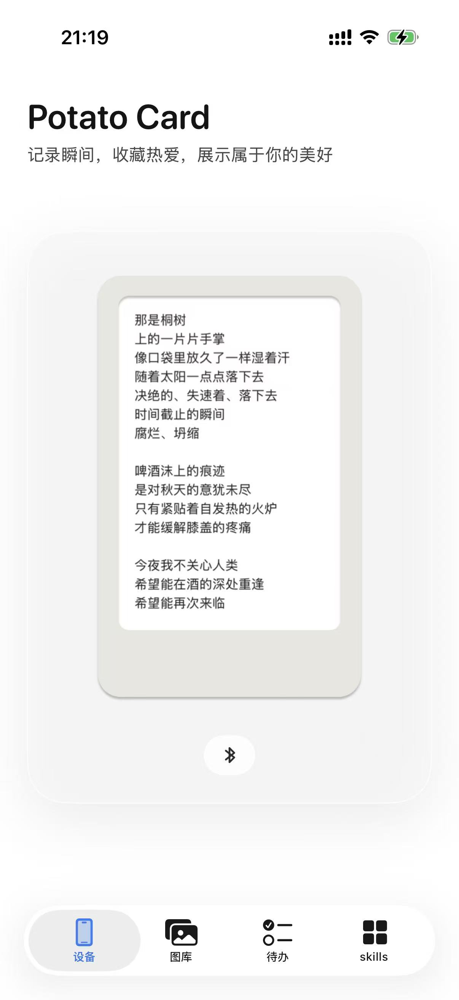
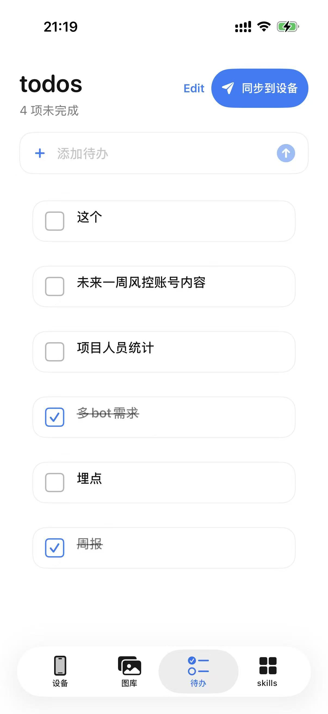
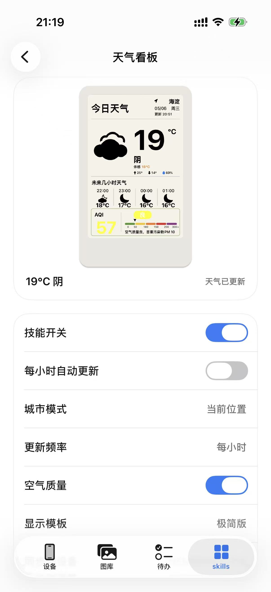

# PotatoCardApp

一个面向 **Potato Card / 土豆片墨水屏设备** 的 iOS App，用来把天气、待办、专辑封面和照片快速传输到电子墨水屏上。

---

## 项目简介

PotatoCardApp 主要解决三件事：

- 连接附近的 Potato Card 蓝牙设备
- 把图片、天气、待办、专辑封面渲染成适合墨水屏的画面
- 通过蓝牙把内容传输到设备，并尽量保持预览和上屏结果一致

---

## Screenshots

| 设备首页 | 待办同步 | Skills |
|------|------|------|
|  |  |  |

---

## 使用场景

- 桌面天气看板
- 待办事项提醒
- 专辑封面展示
- 手机照片传输到墨水屏
- 低功耗信息卡片

---

## 核心功能

### 设备连接
- 自动发现附近设备
- 显示设备电量、蓝牙状态和最后一次投屏画面
- 支持常用设备记忆和快捷连接

### 图片处理
- 适配墨水屏分辨率（如 400×600）
- 支持照片裁剪、缩放和位置调整
- 同一张图片再次传输时自动恢复上次调整参数
- 针对 6 色墨水屏做图片渲染优化

### Skills
- 天气看板：支持和风天气、自定义城市、空气质量、自动更新
- 待办：编辑后可一键同步到设备
- 专辑：内置惘闻、黑帝等专辑封面
- 图库：从系统相册导入图片并传输

### 传输体验
- 实时进度反馈
- 传输状态展示
- Live Activity / 后台任务支持
- 快捷指令触发天气推送

---

## 技术架构

- Swift
- SwiftUI
- CoreBluetooth
- App Intents / Shortcuts
- BackgroundTasks
- ActivityKit
- PickBleManager 设备通信 SDK

---

## 快速开始

### 1. 克隆项目

```bash
git clone git@github.com:Aliang-WorkSpace/PotatoCardApp.git
```

---

### 2. 打开项目

使用 Xcode 打开：

```
potato card.xcodeproj
```

---

### 3. 配置签名

在 Xcode 中：

```
Signing & Capabilities → Team
```

选择你自己的 Apple Developer 账号

---

### 4. 运行

连接真机设备后运行项目

---

## 注意事项

- 本项目处于早期阶段，功能仍在持续完善中
- 部分功能依赖真实设备进行测试
- 墨水屏显示效果与硬件特性相关
- 后台自动更新受 iOS 系统调度影响，不能保证严格按小时执行
- 天气服务需要自行配置可用的和风天气 API

---

## 项目结构

```
PotatoCardApp
├── potato card
│   ├── App
│   ├── Features
│   │   ├── Albums
│   │   ├── Device
│   │   ├── Gallery
│   │   ├── Skills
│   │   └── Todo
│   └── Resources
├── TransferLiveActivityWidget
└── image
```

---

## 隐私与安全

本项目遵循良好的安全实践：

- 不上传用户图片或待办内容到第三方服务
- 不包含证书或敏感配置
- 不包含本地环境文件
- 天气 API 凭据保存在本机 App 配置中

---

## AI 协助开发说明

本项目在开发过程中，部分代码与设计由 AI 工具辅助生成与优化（包括但不限于代码实现、UI 设计与文档编写）。

---

## Roadmap

- [ ] 支持用户自定义专辑内容
- [ ] 继续优化蓝牙传输速度
- [ ] 增加更多墨水屏卡片模板
- [ ] 优化后台自动天气更新稳定性
- [ ] 支持更多分辨率设备
- [ ] 清理 Swift 6 并发 warning

---

## 贡献

欢迎提交 Issue 或 Pull Request，一起完善这个项目。

---

## License

本项目基于 Apache License 2.0 开源。  
在使用、修改或分发本项目时，请遵守相关开源协议。

---


## Links

- GitHub: [Aliang-WorkSpace](https://github.com/Aliang-WorkSpace)
- Project: [PotatoCardApp](https://github.com/Aliang-WorkSpace/PotatoCardApp)
- Hardware reference: [Sunbelife on Weibo](https://weibo.com/u/1675423275)
